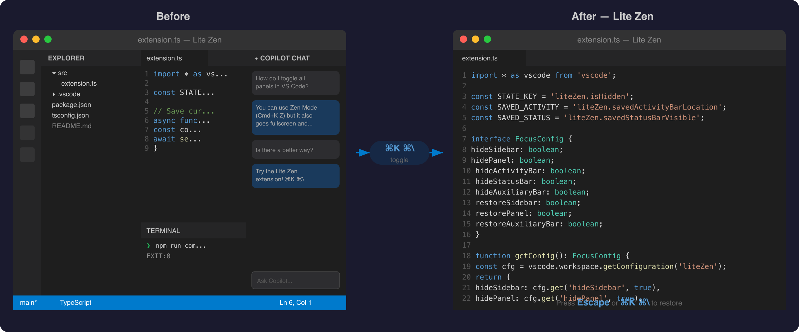

# Lite Zen — Focus on Code, Hide Everything Else

**One hotkey to hide all UI panels. One more to bring them back.**

No fullscreen. No zen mode quirks. Just your editor — instantly.



## Why Lite Zen?

VS Code's built-in Zen Mode does too much: it goes fullscreen, centers your layout, hides line numbers, and mutes notifications. Sometimes you just want to **maximize your editor space** without losing your window position or workflow context.

**Lite Zen** gives you a single toggle that hides all surrounding UI — sidebar, bottom panel, activity bar, status bar, and secondary sidebar — and restores them exactly as they were.

## Features

- **Single hotkey toggle** — `Cmd+K Cmd+\` (Mac) / `Ctrl+K Ctrl+\` (Win/Linux)
- **Escape to restore** — press `Escape` in the editor to bring everything back (peek mode)
- **Hides all 5 UI components**: primary sidebar, bottom panel, activity bar, status bar, auxiliary sidebar
- **Remembers previous state** — restores activity bar position and status bar visibility to their original values
- **Per-component control** — choose exactly which panels to hide/restore via settings
- **No fullscreen** — stays in your current window, keeps your window arrangement intact
- **No side effects** — no centered layout, no hidden line numbers, no muted notifications
- **Workspace-scoped state** — toggle state persists across VS Code restarts

## Installation

### From VS Code

1. Open Extensions (`Cmd+Shift+X`)
2. Search for `Lite Zen`
3. Click **Install**

### From VSIX

```sh
code --install-extension lite-zen-0.1.0.vsix
```

## Usage

| Action            | Mac           | Windows / Linux |
| ----------------- | ------------- | --------------- |
| Toggle all panels | `Cmd+K Cmd+\` | `Ctrl+K Ctrl+\` |
| Restore panels    | `Escape`      | `Escape`        |

Or open Command Palette (`Cmd+Shift+P`) and run **Lite Zen: Toggle All Panels**.

`Escape` only restores panels when focused in the editor and panels are hidden. It won't interfere with other `Escape` uses (closing menus, cancelling search, etc.).

Both hotkeys are fully customizable — rebind them in **Keyboard Shortcuts** (`Cmd+K Cmd+S`).

## Settings

All settings are under `liteZen.*` and can be changed in Settings UI or `settings.json`:

| Setting                         | Default | Description                                    |
| ------------------------------- | ------- | ---------------------------------------------- |
| `liteZen.hideSidebar`         | `true`  | Hide the primary sidebar                       |
| `liteZen.hidePanel`           | `true`  | Hide the bottom panel (terminal, output, etc.) |
| `liteZen.hideActivityBar`     | `true`  | Hide the activity bar                          |
| `liteZen.hideStatusBar`       | `true`  | Hide the status bar                            |
| `liteZen.hideAuxiliaryBar`    | `true`  | Hide the secondary sidebar                     |
| `liteZen.restoreSidebar`      | `true`  | Restore sidebar on toggle back                 |
| `liteZen.restorePanel`        | `true`  | Restore bottom panel on toggle back            |
| `liteZen.restoreAuxiliaryBar` | `true`  | Restore secondary sidebar on toggle back       |

## Lite Zen vs. Alternatives

Compared as of April 2026.

| Feature                  | **Lite Zen**     | Zen Mode (built-in) | [Hide All](https://marketplace.visualstudio.com/items?itemName=pkubik.hide-all) v0.1.0 | [Auto Hide](https://marketplace.visualstudio.com/items?itemName=sirmspencer.vscode-autohide) v1.0.7 |
| ------------------------ | ---------------- | ------------------- | -------------------------------------------------------------------------------------- | --------------------------------------------------------------------------------------------------- |
| Toggle sidebar           | ✅               | ✅                  | ✅                                                                                     | ✅                                                                                                  |
| Toggle bottom panel      | ✅               | ✅                  | ✅                                                                                     | ✅                                                                                                  |
| Toggle activity bar      | ✅               | ✅                  | ❌                                                                                     | ❌                                                                                                  |
| Toggle status bar        | ✅               | ✅                  | ❌                                                                                     | ❌                                                                                                  |
| Toggle auxiliary sidebar | ✅               | ❌                  | ✅                                                                                     | ❌                                                                                                  |
| Escape to restore        | ✅               | ❌                  | ❌                                                                                     | N/A                                                                                                 |
| Restore on re-toggle     | ✅               | ✅                  | ❌ (hide only)                                                                         | N/A                                                                                                 |
| Remembers previous state | ✅               | Partial             | ❌                                                                                     | ❌                                                                                                  |
| Per-component settings   | ✅               | Limited             | ✅                                                                                     | ❌                                                                                                  |
| No fullscreen            | ✅               | ❌ (default)        | ✅                                                                                     | ✅                                                                                                  |
| No centered layout       | ✅               | ❌ (optional)       | ✅                                                                                     | ✅                                                                                                  |
| No hidden line numbers   | ✅               | ❌ (optional)       | ✅                                                                                     | ✅                                                                                                  |
| Trigger                  | Hotkey / Command | Hotkey              | Command only                                                                           | Automatic                                                                                           |
| Last updated             | 2026             | VS Code built-in    | Jan 2023                                                                               | Sep 2021                                                                                            |

## Support

If you find Lite Zen useful, consider supporting its development:

[](https://ko-fi.com/setood)
[](https://buymeacoffee.com/setood)
[](https://github.com/sponsors/setood)

## License

MIT
